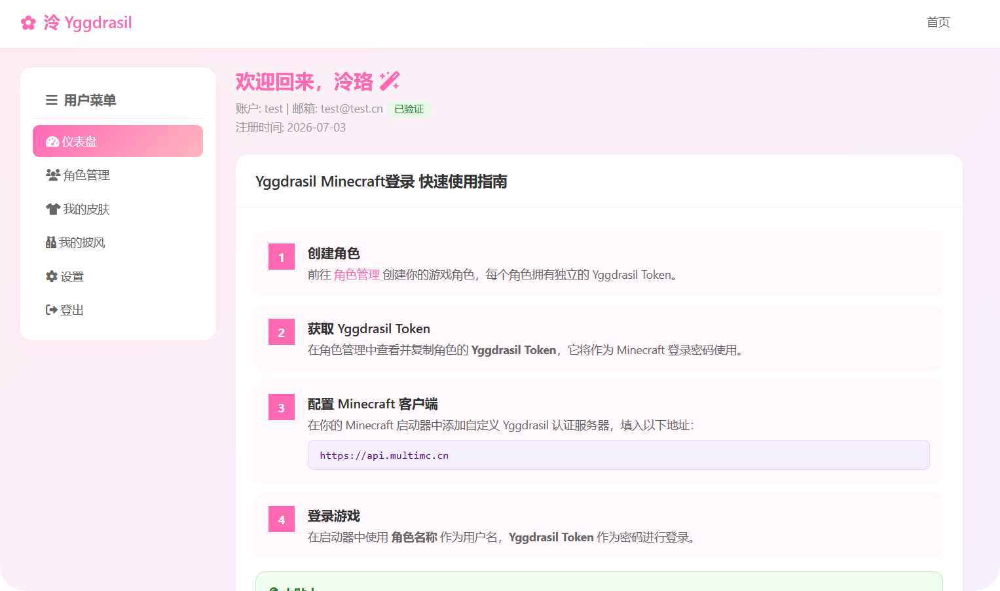
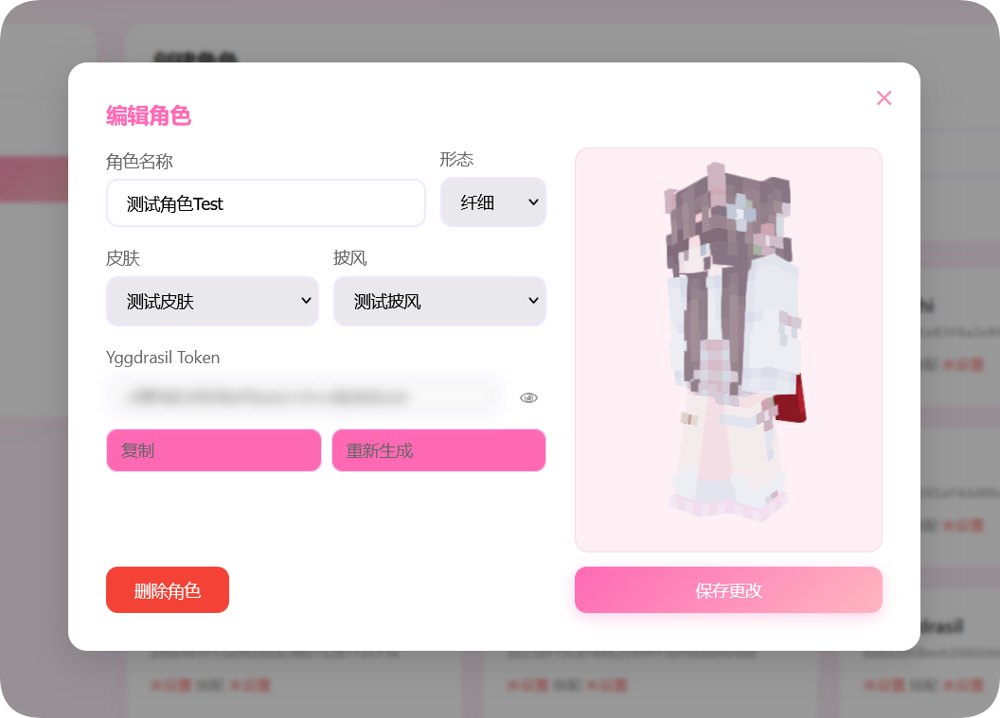

<h1 align="center">泠 Yggdrasil</h1>

<p align="center">
  <em>轻盈、安全、优雅的 Minecraft Yggdrasil 外置鉴权系统</em>
</p>

<p align="center">
  
</p>

<p align="center">
  
  
</p>

<p align="center">
  <a href="README.md">中文</a> | <a href="README_EN.md">English</a>
</p>

---

## 简介

**泠 Yggdrasil** 是一个为 Minecraft 打造的 **Yggdrasil 外置鉴权系统**，完整兼容 `authlib.jar` 体系，提供完整的账户注册、登录、角色管理与皮肤披风托管能力。开箱即用的 Web 安装向导、二次元风格的管控面板、多层级加密体系，让你的外置登录系统既安全又好看。

> **🌐 [在线预览](https://multimc.cn/)** — 这是一个正在运行最新稳定版本 LingYggdrasil 的站点，在动手部署之前，你可以在这里零成本立即体验。


<p align="center">
  
</p>

---

## 特性一览

### 🚀 开箱即用

- **Web 安装向导** — 首次启动自动进入安装页面，引导设置管理员账户、数据库与邮箱服务，全程可视化操作
- **多数据库支持** — 支持 **SQLite**、**MySQL**、**PostgreSQL**，按需选择，无需额外配置
- **单 JAR 部署** — 打包为单个可执行 JAR，放入服务器即可运行

### 🎨 精致的用户界面

- **二次元风格设计** — 粉白主色调，圆角卡片布局，细腻的 CSS 动效
- **响应式布局** — 同时适配桌面端与移动端
- **3D 角色预览** — 集成 skinview3d，在角色编辑时实时预览皮肤与披风效果

### 🔐 安全体系

- **Argon2 密码加密** — 所有用户密码使用 Argon2 算法加密存储，提供 6 级加密强度可调
- **登录速率限制** — 防止暴力破解，自动限制登录尝试频率
- **邮箱验证** — 注册后需通过邮箱验证码激活，支持域名黑白名单控制
- **同 IP 注册限制** — 限制同一 IP 可注册的账号数量，防止批量注册
- **用户名黑名单** — 管理员可配置禁止注册的用户名列表
- **独立会话管理** — 管理员与用户使用完全独立的会话体系，互不干扰

### 👤 用户功能

- **角色管理** — 创建多个游戏角色，每个角色拥有独立的 Yggdrasil Token
- **皮肤 & 披风** — 上传、管理个人皮肤与披风资源，支持别名命名
- **安全设置** — 自主管理密码修改、邮箱验证、Token 查看与重新生成
- **仪表盘引导** — 内置快速使用指南，新用户也能轻松上手

### 🛡️ 管理后台

- **仪表盘总览** — 用户数、角色数、皮肤/披风数量等核心数据一目了然
- **用户管理** — 查看、编辑、封禁用户，支持邮箱验证状态管理
- **角色管理** — 全局 CRUD 操作，支持角色名称修改与所有权转移
- **皮肤 & 披风管理** — 全局管理所有纹理资源，配置上传大小、数量、存储路径与频率限制
- **安全设置** — 6 级加密等级可视化卡片展示，按需调整 Argon2 参数
- **邮箱域名控制** — 白名单/黑名单模式，精确控制可注册的邮箱域名
- **系统设置** — 站点名称、备案号、注册开关等全局配置
- **世界树设置** — Yggdrasil 协议专属配置，包括签名算法、Token 有效期、频率限制等

### 🌳 Yggdrasil 协议

- **完整协议实现** — 兼容主流 Minecraft 启动器的 Yggdrasil 认证接入
- **双签名模式** — 支持 **Ed448**（现代模式）与 **RSA-SHA512**（兼容模式），按需切换
- **Token 体系** — 每个角色自动生成 64 位高强度 Token，作为游戏登录凭证
- **纹理托管** — 公开暴露 `/textures/{type}/{hash}` 端点，游戏客户端可直接访问皮肤与披风
- **会话管理** — 完整的登入/登出与会话验证流程

---

## 安装指南

把大象装进冰箱需要几步？启动 LingYggdrasil 也差不多简单。

### 1. 检查 Java 环境

首先在服务器或本机终端中执行：

```bash
java --version
```

请确认已安装 Java 25。

> 理论上，本程序支持 Java 21 及以上版本；但目前仅在 Java 25 环境下完成测试。
> 如果在非 Java 25 环境中运行出现问题，建议切换至 Java 25。

### 2. 安装 Java 25

如果系统中已经安装 Java 25，可以跳过本步骤。

#### Debian / Ubuntu 等 Linux 发行版

```bash
sudo apt update
sudo apt upgrade -y
sudo apt install openjdk-25-jre -y
```

#### Red Hat / CentOS / Fedora 等 Linux 发行版

根据你的系统选择以下命令之一：

```bash
sudo dnf install java-25-openjdk -y
```

或：

```bash
sudo yum install java-25-openjdk -y
```

#### Windows

请在浏览器中搜索并下载 Java 25 安装包，通常为 `.exe` 或 `.msi` 后缀文件。

下载完成后，双击安装包，并按照安装向导完成安装。

### 3. 下载 LingYggdrasil

前往 Releases 页面，下载最新的稳定版本：

```text
LingYggdrasil.jar
```

将其放置到服务器或本机的任意目录中。

### 4. 启动程序

在 `LingYggdrasil.jar` 所在目录执行：

```bash
java -jar LingYggdrasil.jar
```

你也可以根据服务器配置添加 JVM 内存参数，例如：

```bash
java -Xms512M -Xmx2G -jar LingYggdrasil.jar
```

启动完成后即可开始使用。


---

## 计划中的实现

- [ ] web界面 对 移动端 的适配
- [ ] 好友功能
- [ ] 皮肤库系统，以及可选纹理的私有/公开/好友共享/指定好友共享
- [ ] 修缮账户信息卡片，新增更多实用的显示，例如上一次登录时间和IP地址，操作日志等
- [ ] 优化管理员设置的保存功能，更好更快
- [ ] 管理员的权限组实现，让OP权限组真正有用
- [ ] 用户的权限组实现，更精确的控制
- [ ] 多语言支持
- [ ] 黑夜模式
- [ ] 让API登录时用户名兼容@*.*的后缀，即形如player@y.net被视作player进行登录

---

## 技术栈

| 组件       | 技术                                     |
| ---------- | ---------------------------------------- |
| 语言       | Java 25                                  |
| Web 框架   | [Javalin](https://javalin.io/)           |
| 数据库连接 | [HikariCP](https://github.com/brettwooldridge/HikariCP) 连接池 |
| 数据库     | SQLite / MySQL / PostgreSQL              |
| 加密       | [Bouncy Castle](https://www.bouncycastle.org/) (Argon2, Ed448, RSA) |
| 邮件       | [Eclipse Angus Mail](https://eclipse-ee4j.github.io/angus-mail/) |
| 日志       | [Logback](https://logback.qos.ch/) + SLF4J |
| 序列化     | Jackson                                  |
| 构建工具   | Maven                                    |
