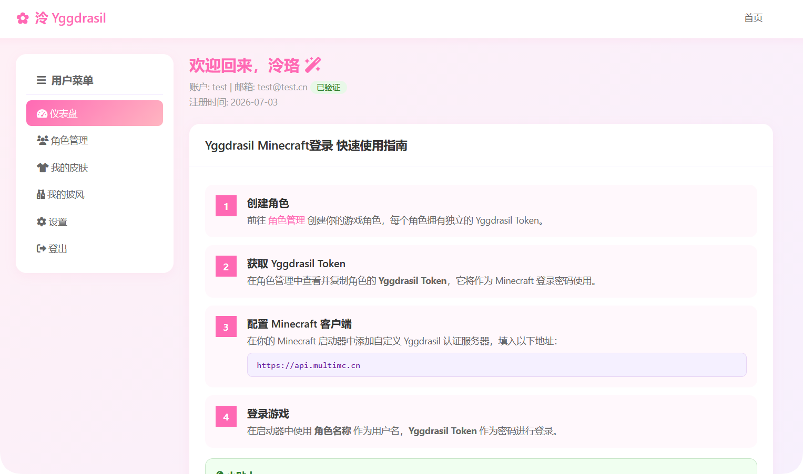
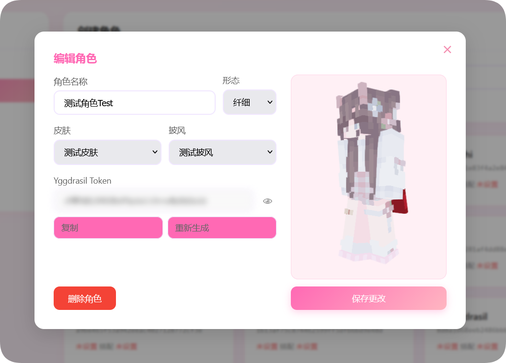
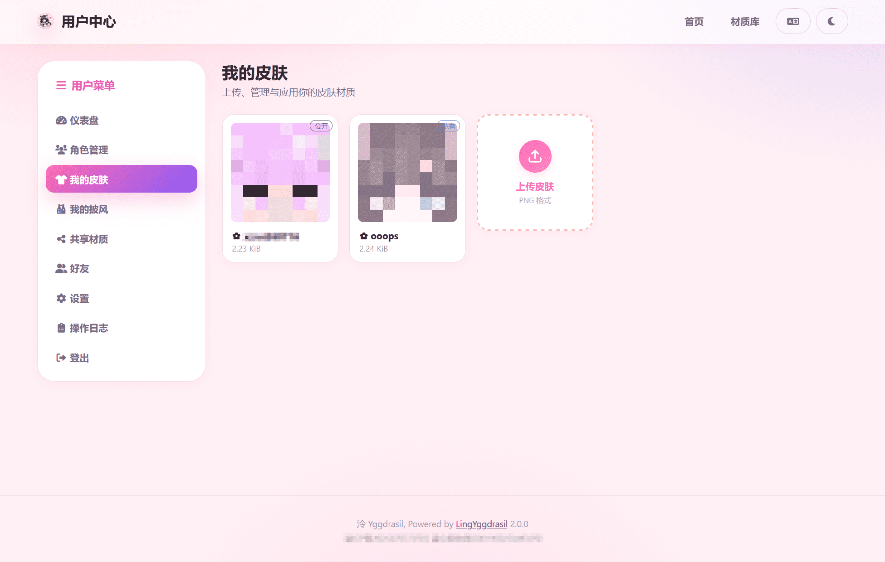
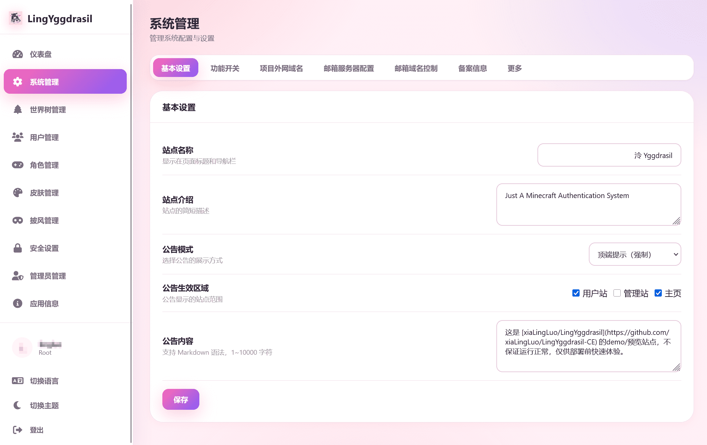

<h1 align="center">泠 Yggdrasil</h1>

<p align="center">
  <em>轻盈、安全、优雅的 Minecraft Yggdrasil 外置鉴权系统</em>
</p>

<p align="center">
  
  
  <a href="https://www.gnu.org/licenses/agpl-3.0">
    
  </a>
</p>

<p align="center">
  <a href="README.md">中文</a> | <a href="README_EN.md">English</a>
</p>

<p align="center">
  
</p>

---

## 简介

**泠 Yggdrasil** 是一个为 Minecraft 打造的 **Yggdrasil 外置鉴权系统**，完整兼容 authlib 体系，提供账户注册、登录、角色管理与皮肤/披风托管能力。内置 Web 安装向导、二次元风格的管控面板与多层级安全体系，让你在几分钟内搭起一套安全又好看的外置登录服务。

> **在线预览**：[multimc.cn](https://multimc.cn/) —— 一个运行着最新稳定版的站点。在动手部署之前，可以先在这里零成本体验。

<p align="center">
  
</p>

---

## 快速开始

把大象装进冰箱需要几步？启动泠 Yggdrasil 也差不多简单。

**环境要求**

| 项目 | 要求                                                              |
|------|-------------------------------------------------------------------|
| Java | **Java 25**（推荐；理论上支持 Java 21+，目前仅在 Java 25 下测试） |
| 内存 | 建议至少 512 MB 可用内存                                          |
| 磁盘 | 视纹理数量而定                                                    |

**三步启动**

```bash
# 1. 确认 Java 版本
java --version

# 2. 下载 LingYggdrasil-2.2.7.jar，放入一个独立的空目录

# 3. 启动（该目录将成为数据目录）
java -Xms512M -Xmx2G -jar LingYggdrasil-2.2.7.jar
```

首次启动会自动进入**安装向导**（`http://<服务器地址>:35598`），按提示完成管理员账户、数据库与邮箱配置即可。安装完成后，程序会同时提供三个服务：

| 端口    | 用途                                       | 访问范围         |
|---------|--------------------------------------------|------------------|
| `35565` | 用户端（注册、登录、仪表盘、皮肤、好友等） | 对外公开         |
| `35577` | Yggdrasil API（供 Minecraft 启动器调用）   | 对外公开         |
| `35599` | 管理后台                                   | **应保持私密**   |
| `35598` | 安装向导                                   | 仅首次安装时开放 |

完整步骤见 **[快速开始文档](docs/01-overview/getting-started.md)**，生产部署见 **[部署与运维](docs/01-overview/deployment.md)**。

> **安全提醒**：管理后台（35599）与安装端口（35598）不应直接暴露到公网，建议通过反向代理限制来源，或仅经内网 / SSH 隧道访问。

---

## 功能特性

### 开箱即用

- **Web 安装向导** —— 首次启动自动引导设置管理员账户、数据库与邮件服务，全程可视化操作。
- **多数据库支持** —— 支持 **SQLite**、**MySQL**、**PostgreSQL**，按需选择，无需额外配置。
- **单 JAR 部署** —— 打包为单个可执行 JAR，放入服务器即可运行。

### 插件系统

- **外部插件加载** —— 启动时自动扫描 `plugins/` 目录并加载插件 jar，安装模式不加载。
- **`plugin.yml` 描述** —— 仿 Paper 风格，声明名称、版本、作者、依赖、图标与权限节点。
- **后台插件管理** —— 一级菜单「插件管理」，总览展示图标、名称、版本、作者、介绍与运行状态，支持手动启停。
- **插件二级菜单** —— 插件可注册至多一个后台二级菜单，承载自身控制功能。
- **动态权限节点** —— 内置节点与插件节点统一由来源（`LingYggdrasil` / 各插件）动态注册，权限组页面按来源分组展示。
- **插件开发 API** —— 构建同步产出 `LingYggdrasil-plugin-api-2.2.7.jar`，自包含，供插件开发者编译。

> 插件为**完全可信代码**，请勿加载来路不明的插件，加载第三方插件后果自负。详见[插件系统](docs/05-plugins/management.md)。

### 安全体系

- **Argon2 密码加密** —— 所有密码使用 Argon2 哈希存储，提供 6 级强度可调。
- **邮箱验证** —— 注册后可通过邮箱验证码激活，支持域名黑白名单控制。
- **同 IP 注册限制** —— 限制同一 IP 可注册的账号数量，防止批量注册。
- **名称黑名单** —— 用户名、角色名、皮肤/披风名均可配置黑名单，支持通配符。
- **独立会话体系** —— 用户端、管理端、API 使用相互隔离的会话 Cookie。
- **Root 完整性保护** —— 校验 `root_info` 表，防止直接篡改数据库绕过 Root 校验。
- **登录与操作限流** —— 登录、注册、纹理上传、日志下载等关键操作均有频率限制。

### 用户端

- **角色管理** —— 创建多个游戏角色，每个角色拥有独立的 Yggdrasil Token 与 UUID，角色卡片展示脸部截取预览。
- **皮肤 & 披风** —— 上传、管理个人皮肤与披风，支持别名命名、公开/私有可控。
- **材质库** —— 公共材质广场，按热度（点赞 + 收藏 × 5）排序，无限滚动懒加载。
- **点赞 & 收藏** —— 为材质点赞助力上热门，收藏到个人共享材质库。
- **共享材质** —— 好友共享与我的收藏双板块，一键将材质应用到角色。
- **好友系统** —— 好友代码添加、好友详情卡片、拉黑管理、勾选式材质共享。
- **3D 皮肤预览** —— 集成 skinview3d，详情弹窗支持 360° 旋转预览。
- **安全设置** —— 自助修改密码、邮箱、昵称，查看与重新生成 Token。
- **操作日志** —— 查看、下载与清空自己的操作日志。
- **主题与语言** —— 浅色/深色主题切换，10 种语言随账户持久化。

<p align="center">
  
</p>

### 管理后台

- **仪表盘总览** —— 用户数、角色数、皮肤/披风数量等核心数据一目了然，组件支持拖拽排序。
- **用户管理** —— 查看、搜索、创建、编辑、封禁用户，管理邮箱验证状态与用户权限组。
- **角色管理** —— 全局 CRUD，支持名称修改、所有权转移与形态切换。
- **皮肤 & 披风管理** —— 全局管理纹理资源，配置上传大小、数量、存储路径与频率限制。
- **安全设置** —— 6 级加密等级可视化卡片，按需调整 Argon2 参数。
- **系统管理** —— 站点信息、功能开关、域名、公告、备案、操作日志等分组配置，各卡片独立保存。
- **权限组** —— 管理员权限组与用户权限组，精细控制菜单可见性与功能可用性。
- **世界树设置** —— 签名算法、Token 有效期、频率限制、UUID 版本等协议配置。

<p align="center">
  
</p>

### Yggdrasil 协议

- **完整协议实现** —— 兼容主流 Minecraft 启动器的 Yggdrasil 认证接入。
- **三种签名模式** —— **Ed448**（现代）、**RSA-SHA512**、**RSA-SHA1**（兼容），按需切换。
- **Token 体系** —— 每个角色自动生成 64 位高强度 Token，作为游戏登录凭证。
- **纹理托管** —— 公开暴露 `/textures/{type}/{hash}` 端点，游戏客户端可直接访问皮肤与披风。
- **会话管理** —— 完整的登入、登出与会话校验流程。
- **便利查询扩展** —— 提供按名查询、批量查询等扩展端点。

### 国际化

内置简体中文、繁体中文、中文（華夏）、English、Русский、Deutsch、Français、Italiano、日本語、한국어 共 10 种语言。语言包为 JSON 格式，支持外部覆盖与深度合并，无需改动程序即可调整文案。

---

## 文档

完整文档分为**七大板块**，入口见 **[docs/README.md](docs/README.md)**。

| 板块 | 说明 |
|------|------|
| [① 概述](docs/01-overview/README.md) | 项目简介、快速开始、部署运维、配置参考、开发构建、常见问题 |
| [② 用户系统](docs/02-user/README.md) | 用户功能、用户权限系统、用户端界面自定义 |
| [③ 管理系统](docs/03-admin/README.md) | 管理后台、管理员权限系统、管理端界面自定义 |
| [④ 世界树系统](docs/04-yggdrasil/README.md) | Yggdrasil 认证、会话与纹理协议 |
| [⑤ 插件系统](docs/05-plugins/README.md) | 插件的安装、查看与启停 |
| [⑥ 安全](docs/06-security/README.md) | 加密体系、会话隔离、请求防护与安全清单 |
| [⑦ 插件开发手册](docs/07-plugin-dev/README.md) | `plugin.yml`、插件 API、路由与示例 |

---

## 客户端接入

以 HMCL 等支持自定义 Yggdrasil 的启动器为例：

1. 在启动器的「账户」或「登录方式」设置中，选择「自定义 Yggdrasil / 外置登录」。
2. 认证服务器地址填写 **API 根地址**（例如 `https://example.com`，直连则填 `http://<IP>:35577`）。
3. 用户名填写**角色名**，密码填写该角色的 **Yggdrasil Token**。

> 关于如何创建角色与获取 Token，见[用户功能指南](docs/02-user/guide.md#角色管理)；协议细节见 [Yggdrasil API](docs/04-yggdrasil/api.md)。

---

## 技术栈

| 组件       | 技术                                                                 |
|------------|----------------------------------------------------------------------|
| 语言       | Java 25                                                              |
| Web 框架   | [Javalin](https://javalin.io/)                                       |
| 数据库连接 | [HikariCP](https://github.com/brettwooldridge/HikariCP) 连接池       |
| 数据库     | SQLite / MySQL / PostgreSQL                                          |
| 加密       | [Bouncy Castle](https://www.bouncycastle.org/)（Argon2、Ed448、RSA） |
| 邮件       | [Eclipse Angus Mail](https://eclipse-ee4j.github.io/angus-mail/)     |
| 日志       | [Logback](https://logback.qos.ch/) + SLF4J                           |
| 序列化     | Jackson                                                              |
| 构建工具   | Maven                                                                |

---

## 参与贡献

欢迎提交 Issue 与 Pull Request。开始之前建议先阅读[开发与构建](docs/01-overview/development.md)，了解源码结构与开发约定。

### 国际化贡献

我们内置 10 种语言，目前除简体中文外的语言均为 AI 翻译，尚未经过人工校对。下表为各语言的翻译进展，**欢迎提交国际化 PR** 完善人工翻译：

| 语言 | AI 翻译进展 | 人工翻译进展 |
|------|-------------|--------------|
| 简体中文（zh-CN）      | 原生语言 | 原生语言 |
| 繁体中文（zh-TW）      | 100%     | 0%       |
| 中文（華夏）（zh-XIA） | 100%     | 0%       |
| English（en-US）       | 100%     | 0%       |
| Русский（ru-RU）       | 100%     | 0%       |
| Deutsch（de-DE）       | 100%     | 0%       |
| Français（fr-FR）      | 100%     | 0%       |
| Italiano（it-IT）      | 100%     | 0%       |
| 日本語（ja-JP）        | 100%     | 0%       |
| 한국어（ko-KR）        | 100%     | 0%       |

语言包位于 `src/main/resources/i18n/`，分为 `user/`（用户端）与 `admin/`（管理端）两套 JSON；首页模板位于 `i18n/user/index-page/`。提交 PR 时请同步更新对应语言的全部键。详见[界面自定义](docs/02-user/customization.md)。

## 许可协议

本项目采用 [GNU Affero General Public License v3.0](LICENSE) 许可协议。
